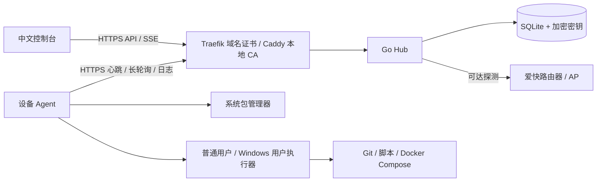

# HomeFleet · 家庭设备统一管理平台

[](https://github.com/xiaoliu-heng/homefleet/actions/workflows/check.yml)
[](LICENSE)

**预览版：面向受信任局域网或 VPN 的单管理员自托管环境。**

中文控制台，管理 Windows、Arch Linux、Ubuntu、Apple Silicon Mac 和爱快网络设备。控制台运行在家庭 Linux 主机的 Docker 中；电脑 Agent 主动通过 HTTPS 连接，不需要开放 SSH 或 WinRM 入站端口。

**选择目标 → 设备预检查 → 查看逐台计划 → 手动确认 → 查看日志和结果。** 没有定时更新，不自动重试结果未知的任务。

## 当前功能

- 全部网卡地址、CPU、内存、GPU、磁盘/卷；10 秒采样、45 秒离线判断、7 天指标保留。详情可切换 CPU/内存、GPU、磁盘可用空间趋势。
- 软件目录映射、准确包名、已安装软件和可用更新；apt、pacman、Homebrew、WinGet 安装和更新。
- Git 项目模板，按系统设置目录、脚本、环境变量和健康检查；预览固定 commit，执行前再次检查未提交改动，结果记录设备实际 HEAD。
- 已登记项目的 Compose 状态、日志、启动、停止和更新。使用项目用户身份，包括其 Docker Desktop 环境。
- 最多并行操作 3 台设备、单设备互斥、持久化逐台结果与日志、仅失败目标重新预检查、未知结果人工核实。
- 一次性注册令牌、可撤销设备凭据、单管理员登录、项目机密 AES-GCM 加密与日志脱敏。
- 爱快路由器/AP 手动登记，通过 ICMP IPv4、TCP 或 HTTP HEAD 探测可达性，管理链接可指向爱快 AC。

尚未接入的设备不会生成虚构指标。GPU、包管理器或权限不满足时，显示具体原因。实机验证范围见 [验收记录](docs/VALIDATION.md)。

## Docker 部署

部署主机需要 Docker Engine 和 Compose 插件；默认使用 443 端口。使用固定局域网 IP，或设备都能解析的内网域名。

```bash
git clone https://github.com/xiaoliu-heng/homefleet.git
cd homefleet
cp .env.example .env
# 编辑 .env：
# HOMEFLEET_HOST=192.168.1.20
# HOMEFLEET_ADMIN_PASSWORD=自选的12至72字节密码
chmod 600 .env
docker compose up -d --build
docker compose ps
```

浏览器访问 `https://你设置的地址`。Caddy 为该地址签发本地 CA 证书。首次密码写入 bcrypt；修改环境变量不会自动更改已有密码。重设密码：

```bash
# 先更新 .env 中 HOMEFLEET_ADMIN_PASSWORD：
docker compose run --rm --no-deps hub --reset-password
```

这会注销已有管理会话。Hub HTTP 端口仅在 Compose 内部网络开放。

443 已占用时，在 `.env` 设置 `HOMEFLEET_HTTPS_PORT=8443` 和 `HOMEFLEET_PUBLIC_URL=https://你的地址:8443`。`HOMEFLEET_BIND_IP` 可指定仅绑定某个内网地址。同时提供局域网与 Tailscale 地址时，额外地址须配置 Caddy 站点证书、端口绑定，并加入 `HOMEFLEET_ALLOWED_ORIGINS`（逗号分隔的完整 HTTPS 来源）。本地 CA 模式下，浏览器生成的接入命令会使用当前访问地址。更多配置见 [部署指南](docs/DEPLOYMENT.md)。

### 复用已有 Traefik 与受信任域名证书

如果已有 Traefik 和有效域名证书，可以复用它们作为 HTTPS 入口。使用受系统信任的证书时，浏览器和 Agent 无需导入本地 CA。

已有 Traefik 提供 `websecure` 入口、有效证书和共享 Docker 网络时，在 `.env` 设置：

```dotenv
COMPOSE_FILE=compose.yaml:compose.traefik.yaml
HOMEFLEET_DOMAIN=homefleet.example.com
HOMEFLEET_PROXY_NETWORK=proxy
# 保留 Caddy 作为本机备用入口，避免占用已有的 443：
HOMEFLEET_BIND_IP=127.0.0.1
HOMEFLEET_HTTPS_PORT=8443
```

如有主机覆盖文件，将 `compose.override.yaml` 加在两个 Compose 文件之间。`docker compose up -d --build` 后，Traefik 根据 Hub 标签发现服务，不需重启代理。覆盖配置将 `HOMEFLEET_CUSTOM_CA=false` 并设置正式 URL；接入命令默认使用该域名，省略 `--ca` / `-CA`，也可在接入窗口改用其他域名或 IP。DNS 必须指向客户端能访问的 Traefik 地址；有效公网证书不要求服务向公网开放。Cloudflare 令牌与证书私钥仍由原有 Traefik 部署管理。

### 导出并信任本地 CA

在部署主机执行，通过可信渠道把证书复制到需要访问的设备：

```bash
docker compose cp caddy:/data/caddy/pki/authorities/local/root.crt ./homefleet-ca.crt
```

安装 Agent 传入 `--ca` / `-CA`，为 Agent 增加该 CA 信任。浏览器还需将证书导入系统信任存储：

| 系统 | 浏览器信任配置 |
|---|---|
| Windows | 管理员 PowerShell：`Import-Certificate -FilePath .\homefleet-ca.crt -CertStoreLocation Cert:\LocalMachine\Root` |
| macOS | 钥匙串访问 → 系统 → 导入证书 → 将该证书设为始终信任 |
| Ubuntu | 复制到 `/usr/local/share/ca-certificates/homefleet.crt`，运行 `sudo update-ca-certificates` |
| Arch | `sudo trust anchor ./homefleet-ca.crt`；浏览器使用独立证书存储时需另行导入 |

核对证书来自自己的部署主机。Agent 不支持跳过 TLS 校验。更改域名/IP 后同步修改 `.env` 和各 Agent 的 `hub_url`。

## 接入电脑

「设备总览 → 接入设备」选择系统，填写或保留「接入地址（下载与连接）」，生成一次性令牌并复制一键安装命令。令牌 15 分钟有效，只注册一台设备。无需先手动下载 Agent；安装入口自动下载对应架构的二进制和安装脚本，验证 SHA-256 后安装。账号留空时使用运行命令的当前普通账号；Linux/macOS 需要 sudo，Windows 需使用项目账号的管理员 PowerShell。

命令中的 `HF_URL` / `$HF_URL` 同时控制下载地址和首次注册后的 Agent 连接地址，可替换为带端口的 HTTPS 域名、IPv4 或带方括号的 IPv6。改变地址不会关闭 TLS 验证。IP 入口默认勾选「使用自建 CA 证书」，填写目标设备上的证书路径；如果该 IP 的证书已受系统信任，可取消勾选。已有 Agent 重新安装仍保留原配置和设备身份；迁移其连接地址需按 [部署记录](docs/DEPLOYMENT.md) 修改 `hub_url`。

### 一键安装示例

Linux / Apple Silicon macOS：将令牌替换为接入窗口生成的值，整段粘贴执行。

```bash
(
  set -e
  HF_URL='https://homefleet.example.com'
  HF_TOKEN='替换为一次性接入令牌'
  HF_TMP="$(mktemp -d)"
  trap 'rm -rf "$HF_TMP"' EXIT
  curl -fsSL --proto '=https' --proto-redir '=https' "$HF_URL/install.sh" -o "$HF_TMP/install.sh"
  bash "$HF_TMP/install.sh" --hub "$HF_URL" --token "$HF_TOKEN"
)
```

Windows 的完整 PowerShell 命令由接入窗口生成，使用同样的地址变量与令牌。它通过 `curl.exe` 下载 `/install.ps1`，以当前管理员账号安装 SYSTEM 服务及用户执行器。

若改用 `https://192.168.1.20:8443` 或 `https://100.64.0.10:8443`，先准备 `homefleet-ca.crt`，在下载命令加 `--cacert ./homefleet-ca.crt`，并在安装命令加 `--ca ./homefleet-ca.crt`（PowerShell 为 `-CA`）。接入窗口会自动生成这两个位置的参数。不要仅替换域名而忽略对应端口和证书。

需单独指定下载源时，已下载的引导脚本支持 `--download-url https://镜像地址:端口` / `-DownloadUrl`；`--hub` / `-Hub` 仍决定 Agent 连接地址。仅检查下载和校验、不注册或安装服务，可使用 `--check-downloads` / `-CheckDownloads`，不需要令牌或管理员权限。自建 CA 场景需使用支持 `--cacert` 的 curl；证书错误会直接停止安装。

公开下载入口只提供安装脚本、Agent 和校验和，不包含管理员凭据或设备令牌；注册仍需单次令牌。手动下载、离线传输也继续支持，以下为手动安装方式。

### Linux / macOS 手动安装

```bash
sudo bash ./install-unix.sh \
  --binary ./homefleet-agent-linux-amd64 \
  --hub https://192.168.1.20 \
  --run-user your_user \
  --token ONE_TIME_TOKEN \
  --ca ./homefleet-ca.crt
```

Apple Silicon 使用 `homefleet-agent-darwin-arm64`；ARM Linux 使用 `homefleet-agent-linux-arm64`。先验证监控可加 `--read-only`。安装器配置 systemd / launchd 服务，保留已有设备身份和执行记录，不自动改变现有配置的运行用户或只读开关。

Homebrew 必须已由指定普通用户安装。Linux 项目用户需已存在，并拥有目录及必要的 Docker socket 权限。Agent 不自动将用户加入 docker 组。

| 系统 | 配置 | 状态 / 日志 |
|---|---|---|
| Linux | `/etc/homefleet/agent.json`；记录在 `/var/lib/homefleet` | `journalctl -u homefleet-agent -f` |
| macOS | `/Library/Application Support/HomeFleet/agent.json` | 同目录 `agent.log`；`sudo launchctl print system/com.homefleet.agent` |

### Windows 10 / 11 手动安装

以**项目实际使用的同一账号**打开管理员 PowerShell：

```powershell
Unblock-File .\install-windows.ps1
.\install-windows.ps1 -Binary .\homefleet-agent-windows-amd64.exe -Hub https://192.168.1.20 -RunUser "$env:USERDOMAIN\$env:USERNAME" -Token ONE_TIME_TOKEN -CA .\homefleet-ca.crt
```

安装器创建 `HomeFleetAgent` SYSTEM 服务和 `HomeFleetUserWorker` 登录计划任务。用户执行器为普通权限；锁屏不影响运行，注销后用户级软件、Git、Docker Desktop 操作显示需要用户登录。配置在 `C:\ProgramData\HomeFleet\agent.json`，执行器凭据在用户的 `%LOCALAPPDATA%\HomeFleet\worker.token`，使用 ACL 限制访问。

系统级操作和软件清单依赖 **Microsoft.WinGet.Client**，需设备管理员完成一次初始化：

```powershell
# 按设备策略确认安装来源，AllUsers 使 SYSTEM 可以加载。
Install-Module Microsoft.WinGet.Client -Repository PSGallery -Scope AllUsers
# 设备尚未提供可用 WinGet 时：
Repair-WinGetPackageManager -AllUsers
```

系统级安装使用 PowerShell 模块 `-Scope System`，用户级安装使用用户执行器的 `winget --scope user`。仅支持具备对应架构、安装范围和静默能力的软件包。交互安装器失败或需要设备端处理时不会被报告为成功。

### GPU 采集

| 设备 | 来源与能力 |
|---|---|
| NVIDIA Windows / Linux | `nvidia-smi`；逐卡 UUID、利用率、显存和温度；不支持的字段显示不可用 |
| AMD Linux 核显 | DRM sysfs `gpu_busy_percent`；KFD 拓扑确认 APU 时标注统一内存，否则内存类型标为待确认，避免把 BIOS 预留容量算成独立显存 |
| Apple Silicon | `macmon pipe -s 1`；用户可通过 `brew install macmon` 安装；显示统一内存 |

缺少 macmon 时 CPU、内存、磁盘仍可采集。安装器不会自动安装显卡驱动或 GPU 工具。

## 操作约定

- **Arch**：从 Agent 0.2.2 起，安装使用 `pacman -S --needed`，只使用已有软件源索引、安装目标及必需依赖；不刷新索引、不自动全量升级。预览和执行前通过只读 `pacman -Qu` 检查：若本机索引已有待升级包（例如此前 `-Syu` 同步后失败），停止安装并要求先完成系统升级。镜像缺少缓存索引中的旧版本时报告失败，不自动扩大操作范围。单包更新和全部更新仍使用 `pacman -Syu --needed` 完整升级，并在预览说明影响。仅正式源，不管理 AUR。可用更新通过 `pacman-contrib` 包提供的 `checkupdates` 使用独立临时索引检查；缺少时显示原因，不执行 `pacman -Sy`。
- **Ubuntu**：apt 预览检查缓存软件包与锁，执行时刷新索引。清单中的更新基于本地索引，查看清单不自动修改系统索引。
- **Mac**：brew 在指定普通用户下运行；cask 如需要 sudo 或 GUI 交互，可能需要本机处理。
- **项目目录**：按系统配置绝对路径。新目录父目录必须存在；现有目录须为当前用户可访问的 Git 仓库。未提交或未跟踪文件均阻止更新；不自动 stash、清理或强制覆盖。
- **Git**：预检查解析具体 commit，执行使用该版本，checkout 为 detached HEAD；完成后读取实际 HEAD，和预览版本分别显示。
- **脚本**：Linux/macOS 使用 Bash `-e -o pipefail`，Windows 使用 PowerShell。不是交互式登录 shell；NVM、虚拟环境需在脚本中显式启用。复用用户 HOME 中 Git/SSH 凭据；桌面 SSH agent、钥匙串可能需预先解锁。
- **健康检查**：退出码为 0 才报告健康；未配置时只报告命令完成。失败保留现场，不自动回滚。
- **Compose**：只管理登记目录内的配置；更新是 pull + up -d --wait；停止是 stop，不删除卷。需用户自己的 Docker 引擎、Compose 和访问权限。
- **取消**：未开始目标立即取消；当前软件包事务继续完成，随后停止后续步骤。卸载或重启服务应在任务完成后进行。
- **待核实**：崩溃、执行器失联等导致结果不明时，该设备不领取新修改任务。核对原进程和真实结果后填写核实记录；仅确认失败/未通过检查的目标可以重新预检查。
- **机密**：额外变量加密保存，运行时注入环境，按已配置机密值脱敏。不要将密钥写进普通变量、脚本、Git URL。编码、变换后的机密不能保证匹配脱敏。

## Agent 版本与后台更新

打开「Agent 更新」查看当前版本，选择设备后依次预览、确认执行。新版成功回连才标记完成，失败时尝试恢复原文件；保留配置、设备身份和执行记录。发布版本和 SHA-256 固定，下载沿用各设备配置的域名或 IP。

**0.1.0 需先用一键安装命令手动更新至当前版本一次**，之后安装为系统服务的 Agent 可在后台更新。只读或临时运行的 Agent 不支持自更新。发布新版、恢复方法和验收边界见 [Agent 更新说明](docs/AGENT-UPDATES.md)。

## 备份、恢复与卸载

```bash
bash scripts/backup.sh /absolute/backup/homefleet-2026-09-28
# 明确替换当前 Compose 部署的数据卷：
bash scripts/restore.sh /absolute/backup/homefleet-2026-09-28 --confirm-replace
```

备份包含 SQLite 一致性快照、`master.key`、部署环境、全部 Compose 覆盖文件、Caddy 配置和 Caddy CA。目录权限限制为本人读取。**丢失 master.key 无法解密机密；本地 CA 模式下丢失 CA 会使已接入设备不再信任控制台。** 外部 Traefik 的证书、DNS 配置由原部署独立备份。

恢复后核对设备 ID 和任务结果，备份之后执行过的操作需要核实，不自动重跑。保留 Agent 本地记录；不要将相同 Agent 配置复制到不同电脑。

卸载：Linux/macOS 运行 `sudo bash scripts/uninstall-unix.sh`；Windows 管理员运行 `scripts/uninstall-windows.ps1`。保留配置与执行记录，在控制台撤销凭据；先核实所有未完成事务。

## 本地开发与构建

需要 Go 1.26+、Node 22.12+ / Node 24、npm。HTTP 开发模式只允许回环地址。

```bash
bash scripts/build.sh
# 产物：bin/homefleet-hub、web/dist、dist/releases（四种 Agent、安装脚本、校验和）
# 输入自己的管理员密码后回车（终端不回显）：
read -r -s HOMEFLEET_ADMIN_PASSWORD
export HOMEFLEET_ADMIN_PASSWORD
./bin/homefleet-hub --dev --db .local/dev/homefleet.db \
  --listen 127.0.0.1:8080 --public-url http://127.0.0.1:8080
```

修改前端后在 `web` 运行 `npm run build`。热更新可在 `web` 运行 `npm run dev`；使用开发代理时，请将 hub 的 public-url 设置为浏览器中的 Vite 地址，以通过 Origin 校验。

只读检查当前设备、不注册不安装服务：

```bash
./dist/releases/homefleet-agent-darwin-arm64 inspect --run-user your_user
```

### 自动化验证

```bash
go test -race ./...
go vet ./...
go build -o bin/homefleet-hub ./cmd/hub
cd web
npm ci
npm run build
npx playwright install chromium
npm run test:e2e
```

浏览器测试启动独立回环 hub（8091）与临时 SQLite，测试 Agent 明确标记，不连接真实设备、不执行包管理器。跨平台编译不等于 Windows/Linux 实机验收。

## 代码与接口



- `cmd/hub`、`internal/server`：认证、API、SSE、探测。
- `internal/store`：SQLite、调度、加密、备份。
- `cmd/agent`、`internal/agent`：采集、预检查、执行、本地记录与恢复。
- `web/src`：React/TypeScript 控制台。
- [API 文档](docs/API.md) · [实机验收记录](docs/VALIDATION.md)

上游参考：[GPU 采集](https://beszel.dev/guide/gpu)、[macmon](https://github.com/vladkens/macmon)、[Homebrew 执行身份](https://docs.brew.sh/FAQ#why-does-homebrew-say-sudo-is-bad)、[Windows SYSTEM 上下文](https://learn.microsoft.com/en-us/windows/package-manager/winget/troubleshooting#system-context)、[WinGet PowerShell 源码](https://github.com/microsoft/winget-cli/tree/master/src/PowerShell)、[Arch 完整升级](https://wiki.archlinux.org/title/Pacman#Upgrading_packages)。


## 许可证与安全

HomeFleet 使用 [MIT License](LICENSE)。第三方组件的版权及许可证保留在 [THIRD_PARTY_NOTICES.md](THIRD_PARTY_NOTICES.md)，发布包和容器也包含这两份文件。依赖变化后运行 `node scripts/third-party-notices.mjs` 重新生成通知（需 Go 和已安装的前端依赖）。

报告安全问题前请阅读 [SECURITY.md](SECURITY.md)。部署配置、设备身份、运行数据、备份及真实环境截图不属于公开源码。
